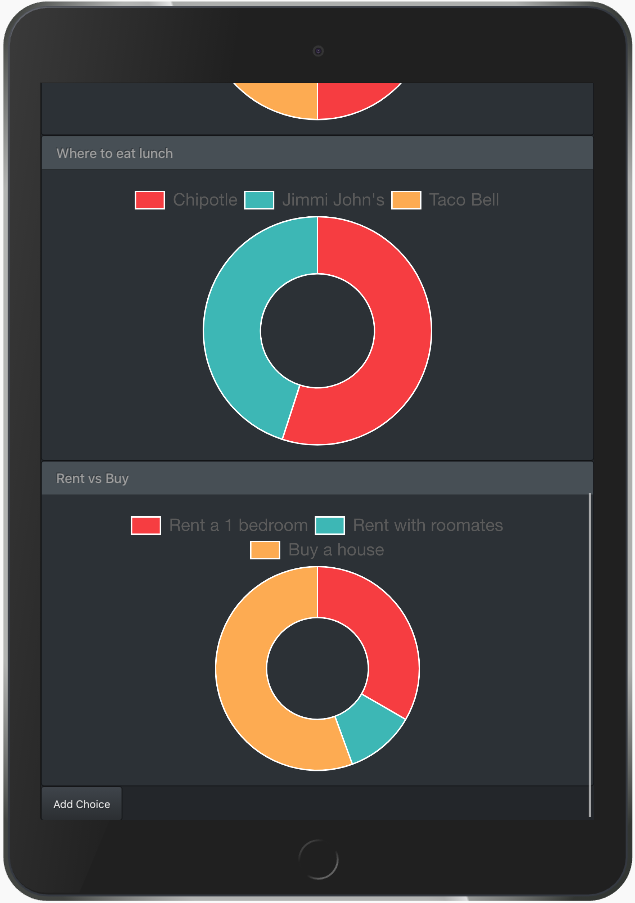
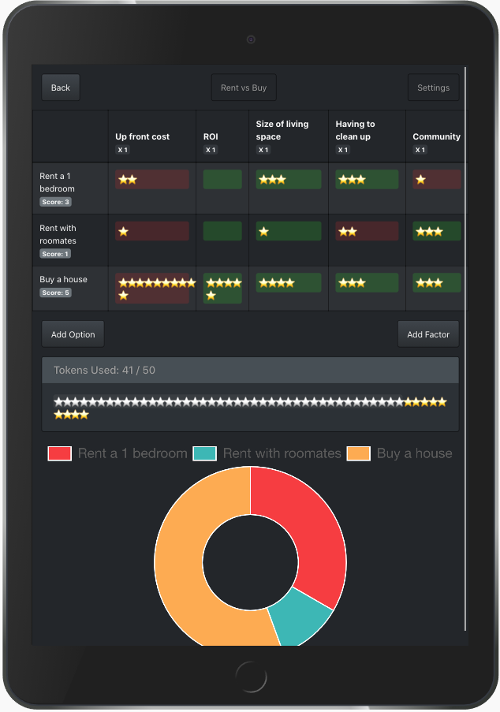
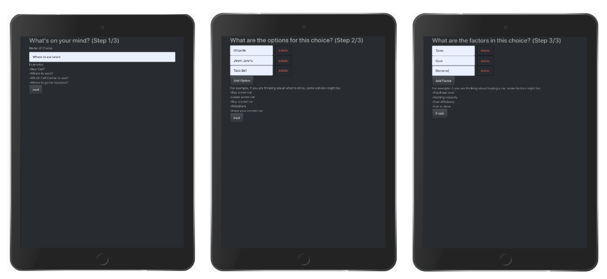

## Chooser helps people make confident choices.

Stuck in a difficult decision? Chooser helps you cut through decision block by helping you break down a decision into smaller increments. Users spend tokens from a limited supply to show how strongly they care about the facets of the decision. 

### Viewing a responsive list of choices

### Weighing individual choices

### Guided flow for setting up new choices

### How to install

This project was bootstrapped with [Create React App](https://github.com/facebook/create-react-app).

To view the create react app instructions go [here](./create-react-app-instructions.md).
